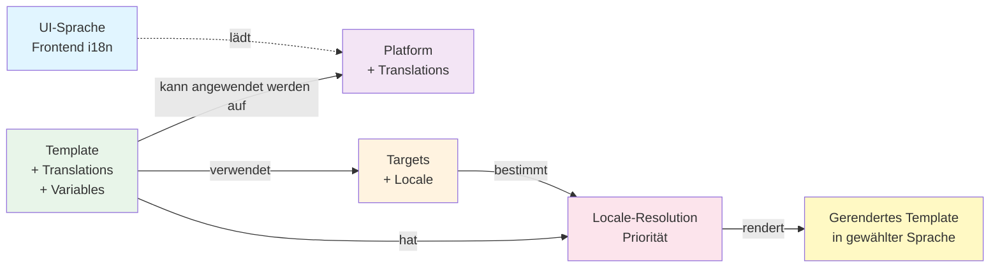
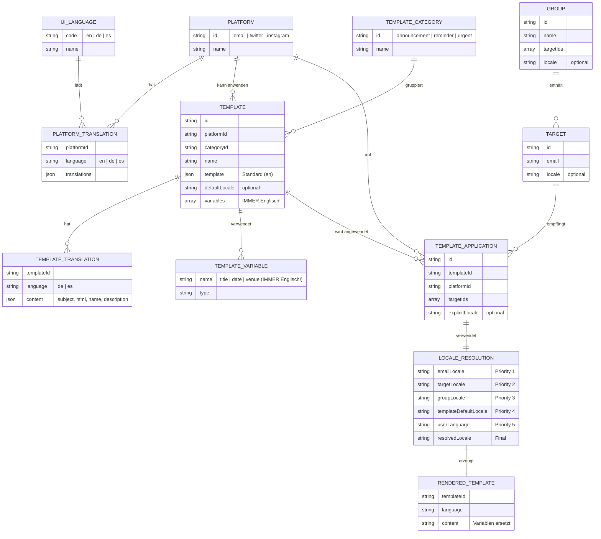

# Template & Language System - Beziehungen

## Übersicht

Dieses Dokument beschreibt die komplexen Beziehungen zwischen UI-Sprache, Template-Sprachen, Platform-Translations, Targets und der Template-Anwendung auf verschiedene Plattformen.

## Vereinfachtes Kern-Diagramm



## Vollständiges Mermaid-Diagramm

```mermaid
graph TB
    %% UI-Ebene
    subgraph UI["🌐 UI-Ebene (Frontend)"]
        UI_LANG["UI-Sprache<br/>(i18n)<br/>en | de | es"]
        UI_LANG -->|steuert| UI_ELEMENTS["UI-Elemente<br/>(Buttons, Labels, etc.)"]
    end

    %% Platform-Ebene
    subgraph PLATFORMS["📱 Platform-Ebene"]
        PLATFORM1["Platform: Email"]
        PLATFORM2["Platform: Twitter"]
        PLATFORM3["Platform: Instagram"]
        
        PLATFORM_TRANS1["Platform Translations<br/>email/locales/en.json<br/>email/locales/de.json<br/>email/locales/es.json"]
        PLATFORM_TRANS2["Platform Translations<br/>twitter/locales/en.json<br/>twitter/locales/de.json"]
        
        PLATFORM1 --> PLATFORM_TRANS1
        PLATFORM2 --> PLATFORM_TRANS2
    end

    %% Template-Ebene
    subgraph TEMPLATES["📝 Template-Ebene"]
        CATEGORY["Template-Kategorien<br/>(plattformübergreifend)<br/>announcement | reminder | urgent | invitation"]
        
        TEMPLATE1["Template: event-announcement<br/>id: 'event-announcement'<br/>category: 'announcement'<br/>variables: ['title', 'date', 'venue']"]
        TEMPLATE2["Template: personal-invitation<br/>id: 'personal-invitation'<br/>category: 'invitation'<br/>variables: ['name', 'title']"]
        
        TEMPLATE_TRANS1["Template Translations<br/>template: { subject, html }<br/>translations.de: { subject, html }<br/>translations.es: { subject, html }<br/>defaultLocale?: 'de'"]
        TEMPLATE_TRANS2["Template Translations<br/>template: { subject, html }<br/>translations.de: { subject, html }"]
        
        TEMPLATE_VARS["Template-Variablen<br/>(IMMER Englisch!)<br/>{title}, {date}, {venue}<br/>{name}, {description}"]
        
        CATEGORY --> TEMPLATE1
        CATEGORY --> TEMPLATE2
        TEMPLATE1 --> TEMPLATE_TRANS1
        TEMPLATE2 --> TEMPLATE_TRANS2
        TEMPLATE1 --> TEMPLATE_VARS
        TEMPLATE2 --> TEMPLATE_VARS
    end

    %% Target-Ebene
    subgraph TARGETS["👥 Target-Ebene"]
        TARGET1["Target 1<br/>email: 'user1@example.com'<br/>locale: 'de'"]
        TARGET2["Target 2<br/>email: 'user2@example.com'<br/>locale: 'en'"]
        TARGET3["Target 3<br/>email: 'user3@example.com'<br/>locale: 'es'"]
        
        GROUP1["Group: VIP<br/>targetIds: [target1, target2]<br/>metadata.locale?: 'de'"]
        GROUP2["Group: Standard<br/>targetIds: [target3]<br/>metadata.locale?: 'en'"]
        
        GROUP1 --> TARGET1
        GROUP1 --> TARGET2
        GROUP2 --> TARGET3
    end

    %% Anwendungs-Ebene
    subgraph APPLICATION["🎯 Template-Anwendung"]
        APPLY1["Template-Anwendung 1<br/>Platform: Email<br/>Template: event-announcement<br/>Targets: [Target1, Target2]"]
        APPLY2["Template-Anwendung 2<br/>Platform: Twitter<br/>Template: event-announcement<br/>Targets: [Target3]"]
        
        LOCALE_RESOLVE["Locale-Resolution<br/>Priorität:<br/>1. Email-Level locale<br/>2. Target locale<br/>3. Group locale<br/>4. Template defaultLocale<br/>5. User Language<br/>6. 'en' (Default)"]
        
        RENDERED1["Gerendertes Template 1<br/>Sprache: 'de'<br/>Subject: 'Event: {title}'<br/>→ 'Event: Depeche Mode Party'"]
        RENDERED2["Gerendertes Template 2<br/>Sprache: 'en'<br/>Subject: 'Event: {title}'<br/>→ 'Event: Depeche Mode Party'"]
        
        APPLY1 --> LOCALE_RESOLVE
        APPLY2 --> LOCALE_RESOLVE
        LOCALE_RESOLVE --> RENDERED1
        LOCALE_RESOLVE --> RENDERED2
    end

    %% Beziehungen zwischen Ebenen
    UI_LANG -.->|lädt| PLATFORM_TRANS1
    UI_LANG -.->|lädt| PLATFORM_TRANS2
    
    TEMPLATE1 -.->|kann angewendet werden auf| PLATFORM1
    TEMPLATE1 -.->|kann angewendet werden auf| PLATFORM2
    TEMPLATE1 -.->|kann angewendet werden auf| PLATFORM3
    TEMPLATE2 -.->|kann angewendet werden auf| PLATFORM1
    
    APPLY1 --> TEMPLATE1
    APPLY1 --> PLATFORM1
    APPLY1 --> TARGET1
    APPLY1 --> TARGET2
    
    APPLY2 --> TEMPLATE1
    APPLY2 --> PLATFORM2
    APPLY2 --> TARGET3
    
    LOCALE_RESOLVE --> TARGET1
    LOCALE_RESOLVE --> TARGET2
    LOCALE_RESOLVE --> TARGET3
    LOCALE_RESOLVE --> GROUP1
    LOCALE_RESOLVE --> GROUP2
    LOCALE_RESOLVE --> TEMPLATE_TRANS1
    LOCALE_RESOLVE --> TEMPLATE_TRANS2

    %% Styling
    classDef uiClass fill:#e1f5ff,stroke:#01579b,stroke-width:2px
    classDef platformClass fill:#f3e5f5,stroke:#4a148c,stroke-width:2px
    classDef templateClass fill:#e8f5e9,stroke:#1b5e20,stroke-width:2px
    classDef targetClass fill:#fff3e0,stroke:#e65100,stroke-width:2px
    classDef applicationClass fill:#fce4ec,stroke:#880e4f,stroke-width:2px
    
    class UI_LANG,UI_ELEMENTS uiClass
    class PLATFORM1,PLATFORM2,PLATFORM3,PLATFORM_TRANS1,PLATFORM_TRANS2 platformClass
    class TEMPLATE1,TEMPLATE2,TEMPLATE_TRANS1,TEMPLATE_TRANS2,TEMPLATE_VARS,CATEGORY templateClass
    class TARGET1,TARGET2,TARGET3,GROUP1,GROUP2 targetClass
    class APPLY1,APPLY2,LOCALE_RESOLVE,RENDERED1,RENDERED2 applicationClass
```



## Detaillierte Erklärungen

### 1. UI-Sprache (Frontend)

Die **UI-Sprache** steuert die Sprache der Benutzeroberfläche (Buttons, Labels, Menüs, etc.). Sie ist **unabhängig** von Template-Sprachen und Target-Sprachen.

- **Lokalisierung**: Über `react-i18next` im Frontend
- **Sprachen**: `en`, `de`, `es`
- **Einfluss**: Nur auf UI-Elemente, nicht auf Template-Inhalte

### 2. Platform-Translations

Jede **Platform** hat eigene Übersetzungen für ihre UI-Elemente (z.B. "Subject", "Recipients", etc.).

- **Struktur**: `platforms/{platformId}/locales/{lang}.json`
- **Beispiel**: `platforms/email/locales/de.json` enthält deutsche Übersetzungen für Email-UI-Elemente
- **Verwendung**: Werden dynamisch geladen via `usePlatformTranslations` Hook

### 3. Templates (Standalone & Gruppiert)

**Templates** sind:
- **Standalone**: Jedes Template hat eine eindeutige ID und kann unabhängig existieren
- **Gruppiert**: Templates werden nach **Kategorien** gruppiert (announcement, reminder, urgent, etc.)
- **Plattformübergreifend**: Kategorien sind plattformübergreifend, aber Templates sind plattformspezifisch

**Template-Struktur**:
```typescript
{
  id: 'event-announcement',
  name: 'Event Announcement',
  category: 'announcement', // Gruppierung
  template: { subject: '...', html: '...' }, // Standard (en)
  translations: {
    de: { subject: '...', html: '...' },
    es: { subject: '...', html: '...' }
  },
  defaultLocale?: 'de', // Optional: Template-Standardsprache
  variables: ['title', 'date', 'venue'] // IMMER Englisch!
}
```

### 4. Template-Variablen (Immer Englisch!)

**Wichtig**: Template-Variablen sind **immer auf Englisch**, da sie technische Platzhalter sind:

- `{title}`, `{date}`, `{venue}`, `{name}`, `{description}`
- Werden durch **Daten** ersetzt (die können übersetzt sein)
- Template-Struktur bleibt sprachunabhängig

### 5. Template-Translations

Templates können **mehrsprachig** sein:

- **Standard**: `template` (meist Englisch)
- **Übersetzungen**: `translations.de`, `translations.es`
- **Default-Locale**: Template kann eine Standardsprache haben (`defaultLocale`)

### 6. Targets & Groups (mit Sprachen)

**Targets** können unterschiedliche Sprachen haben:

```json
{
  "id": "target-123",
  "email": "user@example.com",
  "locale": "de"  // Target-spezifische Sprache
}
```

**Groups** können auch eine Sprache haben:

```json
{
  "id": "group-vip",
  "name": "VIP",
  "targetIds": ["target-1", "target-2"],
  "metadata": {
    "locale": "de"  // Group-spezifische Sprache
  }
}
```

### 7. Template-Anwendung auf verschiedene Plattformen

Ein **Template** kann auf **verschiedene Plattformen** angewendet werden:

- Template `event-announcement` kann auf Email, Twitter, Instagram angewendet werden
- Jede Platform hat ihre eigenen **Editor-Schemas** (Blocks)
- Template wird via `TemplateMappingService` auf Platform-Schema gemappt

### 8. Locale-Resolution (Priorität)

Wenn ein Template angewendet wird, wird die **Locale** in folgender Priorität aufgelöst:

1. **Email-Level** (höchste Priorität) - Explizit im Email-Content gesetzt
2. **Target-Level** - Locale pro Empfänger (Target)
3. **Group-Level** - Locale pro Gruppe
4. **Template-Level** - Default-Locale des Templates
5. **User Language** - Sprache aus User Preferences
6. **Default** - Englisch ('en')

### 9. Beispiel-Szenario

**Szenario**: Template `event-announcement` auf Email-Plattform anwenden

1. **Template auswählen**: `event-announcement` (Kategorie: `announcement`)
2. **Platform auswählen**: `email`
3. **Targets auswählen**: 
   - Target 1 (locale: `de`)
   - Target 2 (locale: `en`)
   - Target 3 (locale: `es`)
4. **Locale-Resolution**:
   - Target 1 → Template wird auf Deutsch gerendert (aus `translations.de`)
   - Target 2 → Template wird auf Englisch gerendert (aus `template`)
   - Target 3 → Template wird auf Spanisch gerendert (aus `translations.es`)
5. **Variablen-Ersetzung**:
   - `{title}` → "Depeche Mode Party" (Daten, nicht übersetzt)
   - `{date}` → "2026-05-16" (formatiert nach Locale)
   - `{venue}` → "Werk 2, Leipzig"

## Entity-Relationship-Diagramm (Datenstrukturen)



## Wichtige Prinzipien

1. **UI-Sprache ≠ Template-Sprache**: Die UI kann auf Deutsch sein, während Templates auf Englisch/Spanisch gerendert werden
2. **Template-Variablen sind immer Englisch**: Technische Platzhalter bleiben sprachunabhängig
3. **Templates sind standalone, aber gruppiert**: Jedes Template ist unabhängig, aber wird nach Kategorien organisiert
4. **Templates sind plattformübergreifend anwendbar**: Ein Template kann auf verschiedene Plattformen angewendet werden
5. **Targets können unterschiedliche Sprachen haben**: Jeder Target kann eine eigene Sprache haben
6. **Locale-Resolution hat Priorität**: Die finale Sprache wird durch eine klare Prioritätsliste bestimmt
